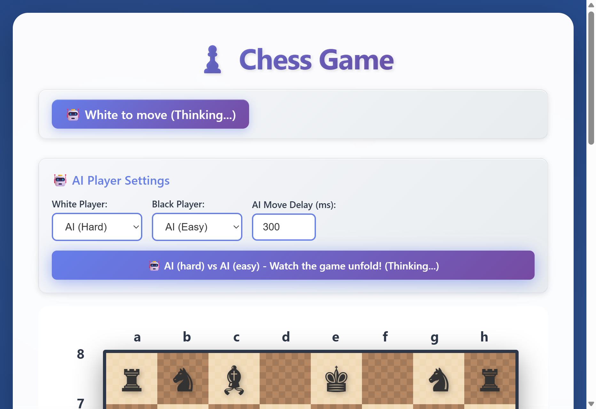

# ♟️ Chess Game

[](https://github.com/roryp/cursor/actions/workflows/deploy.yml)
[](tests/chess.spec.js)
[](LICENSE)

**[▶️ Play Now](https://roryp.github.io/cursor/)**

A feature-rich, browser-based chess game with AI opponents, move validation, famous game replays, and a beautiful modern UI. Play against a friend, challenge the AI, or watch AI vs AI battles unfold!

---

## ✨ Features

### 🎮 Game Modes
| Mode | Description |
|------|-------------|
| **Human vs Human** | Classic two-player chess on the same device |
| **Human vs AI** | Challenge the AI as White or Black |
| **AI vs Human** | Let the AI make the first move |
| **AI vs AI** | Watch two AI players battle it out automatically |

### 🤖 AI Player (Powered by Rules Engine)
- **Adaptive Strategy Engine**: Pure code-based chess AI that adapts to board state
- **Dynamic Strategy Selection**:
  - 📖 **Opening**: Develop knights/bishops, control center, avoid early queen moves
  - ⚔️ **Aggressive**: When behind in material - seek complications, attack, give checks
  - 🛡️ **Consolidate**: When ahead in material - trade pieces, simplify, avoid risk
  - 🏃 **Escape Check**: Prioritize king safety when in check
  - 👑 **Endgame**: Push passed pawns, activate king, corner opponent king
- **Smart Capture Logic**: MVV-LVA (Most Valuable Victim - Least Valuable Attacker)
- **Piece Safety Analysis**: Avoids moving pieces to undefended attacked squares
- **Position Evaluation**: Piece-square tables for strategic positioning
- **Check Detection**: Prioritizes check-giving moves
- **Real-time Thinking**: Watch the AI think with detailed console logs
- **Configurable Move Delay**: 100ms to 3000ms for comfortable viewing
- **No LLM Required**: Fully functional without external services

### 🤝 Draw Detection
- ✅ **Threefold Repetition** - Game ends when the same position occurs 3 times
- ✅ **50-Move Rule** - Draw after 50 moves without pawn move or capture
- ✅ **Move Limit** - Safety cap at 200 moves for AI vs AI games

### ♔ Chess Features
- ✅ Full move validation for all pieces (King, Queen, Rook, Bishop, Knight, Pawn)
- ✅ **Check Detection** - Shows when a king is under attack
- ✅ **Checkmate Detection** - Game ends with "♚ Checkmate!" announcement
- ✅ **Stalemate Detection** - Recognizes when a player has no legal moves
- ✅ **Pawn Promotion** - Pawns automatically promote to Queen on reaching the last rank
- ✅ Pawn double-move from starting position
- ✅ Diagonal pawn captures
- ✅ Path blocking detection for sliding pieces
- ✅ Move history with algebraic notation (e.g., `e2e4`)
- ✅ Board flip to view from either player's perspective
- ✅ Visual piece selection highlighting
- ✅ Turn indicator with player type (👤 Human / 🤖 AI) and check status

### 🏆 Famous Games Library
Replay legendary chess matches move-by-move:

| Game | Players | Year | Description |
|------|---------|------|-------------|
| The Immortal Game | Anderssen vs Kieseritzky | 1851 | Brilliant sacrifices |
| The Opera Game | Morphy vs Allies | 1858 | Perfect coordination |
| Game of the Century | Fischer vs Byrne | 1956 | 13-year-old Fischer's masterpiece |
| Deep Blue vs Kasparov | Deep Blue vs Kasparov | 1997 | Historic AI milestone |
| Kasparov's Immortal | Kasparov vs Topalov | 1999 | Sacrificial masterpiece |

---

## 🚀 Quick Start

### Option 1: Play Online
Simply visit **[https://roryp.github.io/cursor/](https://roryp.github.io/cursor/)** - no installation needed!

### Option 2: Run Locally

```bash
# Clone the repository
git clone https://github.com/roryp/cursor.git
cd cursor

# Option A: Open directly in browser
# Just double-click index.html or open it with your browser

# Option B: Use a local server (recommended)
npx serve
# Then open http://localhost:3000
```

---

## 🎯 How to Play

### Basic Controls
1. **Select a piece**: Click on any piece of your color
2. **Make a move**: Click on a valid destination square
3. **New Game**: Reset the board to starting position
4. **Flip Board**: View the board from the opposite side

### Setting Up AI Players
1. Use the **AI Player Settings** panel at the top
2. Set **White Player** to Human or AI
3. Set **Black Player** to Human or AI
4. Adjust **AI Move Delay** for comfortable viewing
5. Click **New Game** to start with your settings

### Watching Famous Games
1. Select a game from the **Famous Games** dropdown
2. Click **Load Game** to start the replay
3. Use **Next ▶** and **◀ Previous** to step through moves
4. Click **Stop Replay** to end and return to normal play

---

## 📸 Screenshots

### Chess Board
The main game board with all pieces in starting position:


### AI Player Settings
Configure Human vs AI, AI vs Human, or AI vs AI matches:



### Famous Game Replay
Watch historic games like "The Immortal Game" with play controls:


---

## 🏗️ Project Structure

```
chess/
├── index.html          # Main HTML file with game layout
├── chess.js            # Game logic, Rules Engine AI, and event handling
├── chess.css           # Styling and animations
├── package.json        # Project metadata and dependencies
├── playwright.config.js # Test configuration
├── README.md           # This file
├── assets/             # Screenshots and images
└── tests/
    └── chess.spec.js   # Playwright end-to-end tests
```

---

## 🧪 Testing

The project includes comprehensive Playwright tests covering all features:

```bash
# Install dependencies
npm install

# Run all tests
npx playwright test

# Run tests with UI
npx playwright test --ui

# View test report
npx playwright show-report
```

### Test Coverage
- ✅ Board rendering (64 squares, 32 pieces)
- ✅ Turn indicator updates
- ✅ Piece selection and movement
- ✅ Move validation (legal and illegal moves)
- ✅ Board flip functionality
- ✅ Game reset
- ✅ Famous games loading and replay
- ✅ AI settings panel
- ✅ AI player configuration
- ✅ AI move generation
- ✅ AI vs AI gameplay
- ✅ Human move blocking during AI turn

---

## 🔧 Technical Details

### AI Rules Engine Architecture
The chess AI uses a **comprehensive rules engine** that adapts strategy based on board state:

**1. Board State Analysis:**
- Material count for both sides
- Game phase detection (opening/middlegame/endgame)
- King safety evaluation
- Strategic mode selection

**2. Strategic Modes:**
| Mode | Trigger | Behavior |
|------|---------|----------|
| `develop` | Opening phase | Develop pieces, control center |
| `aggressive` | Down 5+ material | Seek complications, attack |
| `consolidate` | Up 5+ material | Trade pieces, simplify |
| `escape_check` | King in check | Prioritize safety |
| `endgame` | Low material | Push pawns, activate king |

**3. Move Scoring Components:**
- **Captures**: MVV-LVA scoring (Queen=900, Rook=500, etc.)
- **Checks**: +800 bonus for check-giving moves
- **Safety**: Penalize moves to attacked squares
- **Position**: Piece-square table bonuses
- **Development**: Bonus for piece development in opening

**Piece Values:**
| Piece | Value |
|-------|-------|
| Pawn | 100 |
| Knight | 320 |
| Bishop | 330 |
| Rook | 500 |
| Queen | 900 |
| King | 20,000 |

### Technologies Used
- **HTML5** - Semantic markup
- **CSS3** - Modern styling with animations, gradients, and transitions
- **Vanilla JavaScript** - No frameworks, pure ES6+
- **Rules Engine** - Custom tactical/positional evaluation
- **Playwright** - End-to-end testing

### Browser Support
- ✅ Chrome/Edge (latest)
- ✅ Firefox (latest)
- ✅ Safari (latest)
- ✅ Mobile browsers

---

## 🤝 Contributing

Contributions are welcome! Here are some ideas:

- [ ] Add castling support
- [ ] Add en passant captures
- [x] ~~Add pawn promotion~~ ✅ Implemented!
- [x] ~~Add check/checkmate detection~~ ✅ Implemented!
- [x] ~~Add draw detection (stalemate, 50-move rule, repetition)~~ ✅ Implemented!
- [ ] Add move undo/redo
- [ ] Add PGN import/export
- [ ] Add sound effects
- [ ] Add multiplayer over network

### Development Setup

```bash
# Clone and install
git clone https://github.com/roryp/cursor.git
cd cursor
npm install

# Start development server
npx serve

# Run tests in watch mode
npx playwright test --watch
```

---

## 📄 License

This project is licensed under the ISC License - see the [LICENSE](LICENSE) file for details.

---

## 🙏 Acknowledgments

- Chess piece Unicode symbols from the Unicode Standard
- Famous games data from historical chess records
- Inspired by classic chess interfaces

---

<p align="center">
  Made with ♟️ and ☕
  <br>
  <a href="https://roryp.github.io/cursor/">Play Now</a> •
  <a href="https://github.com/roryp/cursor/issues">Report Bug</a> •
  <a href="https://github.com/roryp/cursor/issues">Request Feature</a>
</p>
