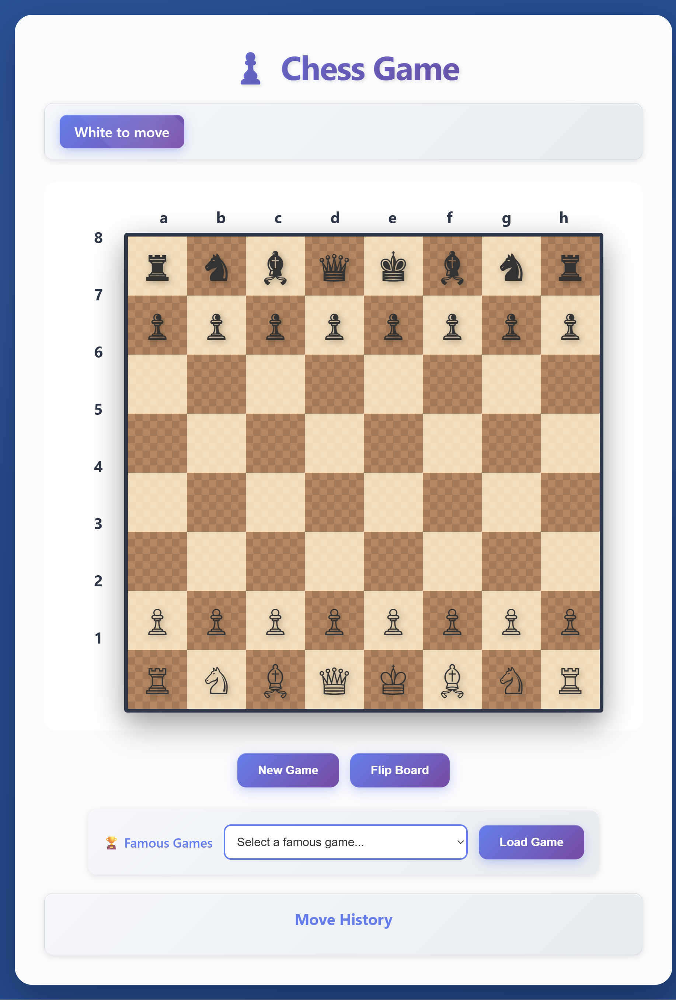
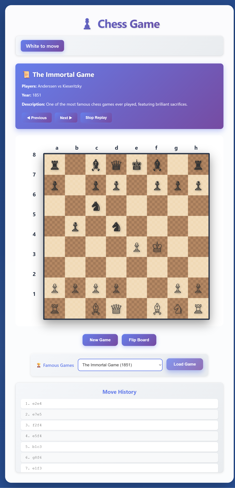

# Chess Game

Simple in-browser chess board with move validation, move history, board flip, and famous game replays.

## Features
- Play standard chess with basic move legality checks for all pieces.
- Move history list with algebraic-like square notation (e.g., `e2e4`).
- Board flip to view from either side.
- Famous game selector with replay controls (next, previous, stop).
- New game reset.

## Quick Start
1. Clone the repository.
2. Open `index.html` in a modern browser (double-click or use `file://`).
3. Play: click a piece, then click a target square. Use **New Game** to reset and **Flip Board** to change perspective.
4. Optional: choose a famous game from the dropdown and click **Load Game** to watch the replay.

## Screenshots

### Chess Board
The main game board with all pieces in starting position:

### Famous Game Replay
Watch historic games like "The Immortal Game" with play controls:

## Notes
- No build step is required; everything runs client-side.
- Pure vanilla JavaScript with no external dependencies.

